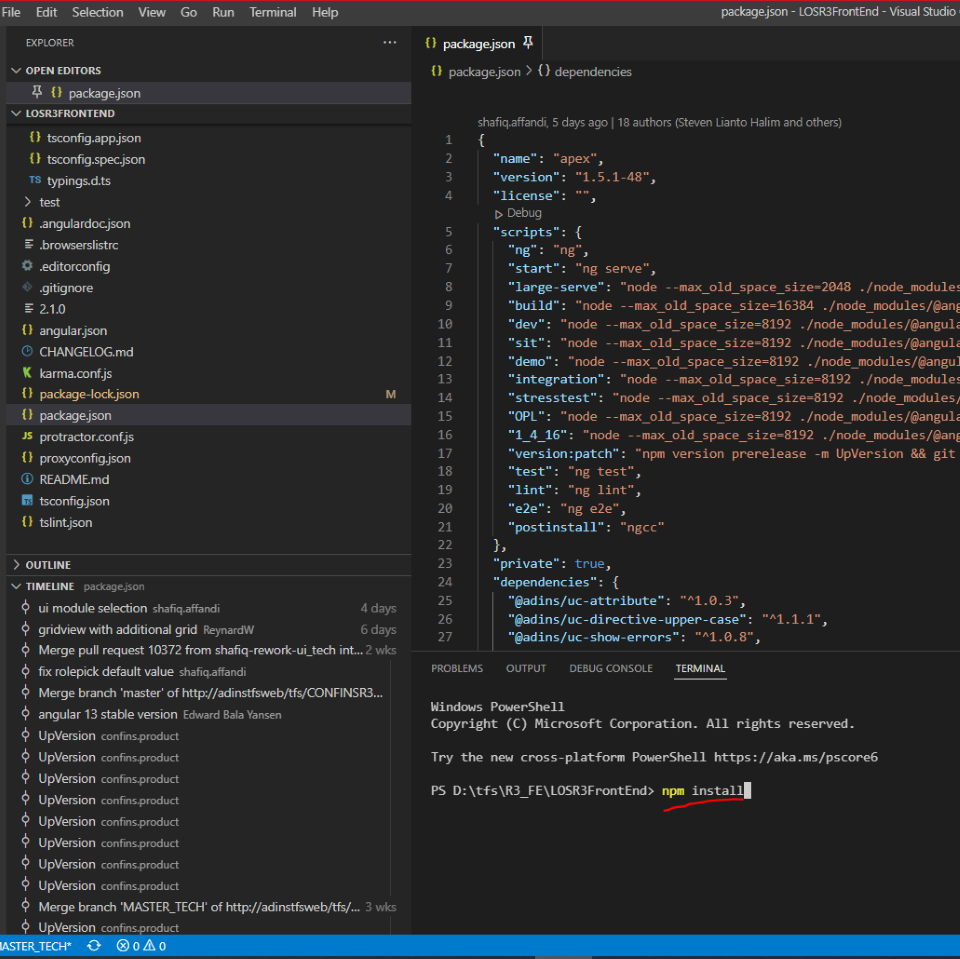

## Procedure

1. Install Visual Studio Code, bisa download dari https://code.visualstudio.com/Download
2. Install Git, bisa download dari https://git-scm.com/download/win
3. Angular 7
    - Install Node Js, bisa download dari https://nodejs.org/dist/v10.15.0/node-v10.15.0-x64.msi
    - Angular 7, menggunakan command prompt command "npm install -g @angular/cli@7.0.1"
4. Angular 13
    - Install Node Js, bisa download dari https://nodejs.org/dist/v14.16.1/node-v14.16.1-x64.msi
    - Angular 13, menggunakan command prompt command "npm install -g @angular/cli"
5. buat folder untuk simpan project
6. buka cmd, path nya dalam folder itu
7. git clone "https://tfs.ad-ins.com/tfs/CONFINSR3/FoundationR3/_git/TrainingRepo"
8. buka VSCode, open folder TrainingRepo
9. 
10. Jalani command berikut
```
npm config set //registry.npmjs.org/:_authToken 09829b11-ac1f-443b-9020-bb4b0a4ac21a
npm install
ng serve
```