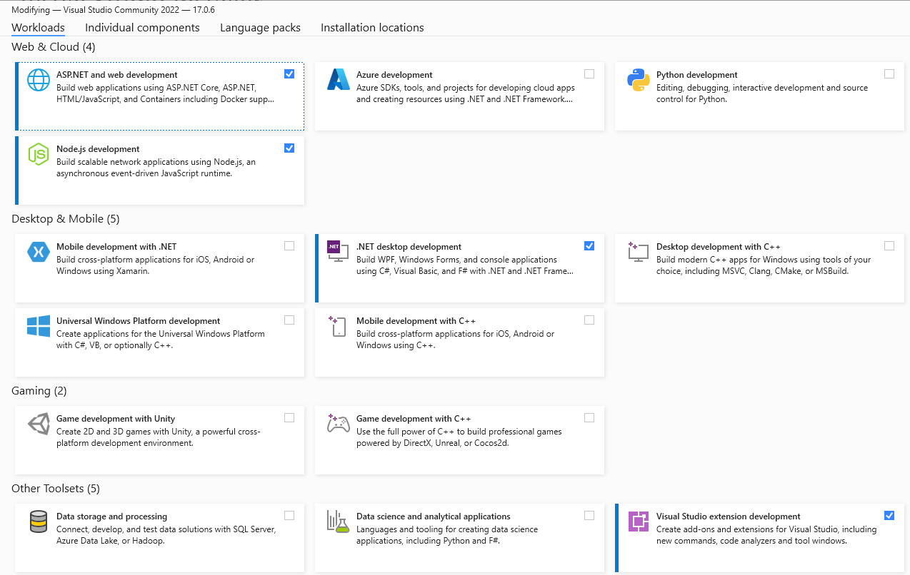

## Procedure

1. Install Visual Studio 2022 Community (.NET 6.0 / .NET 5.0)
2. Pilih workload :​​​​​​​
    - Universal Windows Platform Development
    - ASP .NET and web development
    - Visual Studio extension development
3. Install .NET SDK 5.0.1, bisa download dari [`.NET 5 Download Link`](https://dotnet.microsoft.com/download/dotnet/thank-you/sdk-5.0.100-windows-x64-installer)
4. Install .NET SDK 6.0, bisa download dari [`.NET 6 Download Link`](https://dotnet.microsoft.com/en-us/download/dotnet/thank-you/sdk-6.0.102-windows-x64-installer)
5. Setup Nuget Private (AdIns), Doc : [`Nuget Docs`](https://adins3.sharepoint.com/:b:/s/ConfinsR3CodeGuideline/EdCjcuWX2khBpVSmvMRmHAIBh-G-Hi3DUP7-xE1T6M57Tw?e=BcYGt6)
    1. Tools -> Nuget Package Manager -> Package Manager Settings -> Package Sources -> Add New
    2. Change Name with "AdIns Development Package .NET 5"
    3. Change Source with "http://r3app-server:5500/v3/index.json"
    4. Tools -> Nuget Package Manager -> Package Manager Settings -> Package Sources -> Add New
    5. Change Name with "AdIns Development Package .NET 6"
    6. Change Source with "http://r3app-server:5400/v3/index.json"
6. Ubah default projectnya ke AdIns.{Apps}.API
7. Ubah dari Launch Projectnya dari IIS Express ke AdIns.{Apps}.API
8. Coba build frameworknya dan pastikan tidak error lalu coba di F5

Workload Visual Studio